### Authors: Dariusz Bursztynowski, O-PL; Andrzej Denisiewicz, O-PL 
### Dec. 28th, 2023

# DISTRIBUTED CONTROL LOOP BASED ON K8S OPERATORS - DEMO GUIDE

# Table of contents

1. [CHAPTER I. INTRODUCTION](https://gitlab.com/adenisiewicz/closedloop/-/blob/secondloop2/README2.md#chapter-i-introduction)
2. [CHAPTER II. GETTING STARTED](https://gitlab.com/adenisiewicz/closedloop/-/blob/secondloop2/README2.md#chapter-ii-getting-started)
3. [CHAPTER III. KUBEBUILDER CLOSEDLOOP FROM SCRATCH \(and a little about running on minikube\)](https://gitlab.com/adenisiewicz/closedloop/-/blob/secondloop2/README2.md#chapter-iii-kubebuilder-closedloop-from-scratch-and-a-little-about-running-on-minikube)
4. [CHAPTER IV. CONSOLIDTED ACTION SET](https://gitlab.com/adenisiewicz/closedloop/-/blob/secondloop2/README2.md#chapter-iv-consolidted-action-set)
   1. [Uninstall/undeploy](https://gitlab.com/adenisiewicz/closedloop/-/blob/secondloop2/README2.md#uninstallundeploy)
   2. [All steps needed to run the demo](https://gitlab.com/adenisiewicz/closedloop/-/blob/secondloop2/README2.md#all-steps-needed-to-run-the-demo)
5. [CHAPTER V. DEMONSTRATOR - TWO CASES](https://gitlab.com/adenisiewicz/closedloop/-/blob/secondloop2/README2.md#chapter-v-demonstrator-two-cases)
   1. [Introduction - top level view](https://gitlab.com/adenisiewicz/closedloop/-/blob/secondloop2/README2.md#introduction-top-level-view)
   2. [Case A: Reactive closed loop (isolated loop case)](https://gitlab.com/adenisiewicz/closedloop/-/blob/secondloop2/README2.md#case-a-reactive-closed-loop-isolated-loop-case)
   3. [Case B: Combined reactive & deliberative loops (loop interworking)](https://gitlab.com/adenisiewicz/closedloop/-/blob/secondloop2/README2.md#case-b-combined-reactive-deliberative-loops-loop-interworking)

# CHAPTER I. INTRODUCTION

## Scope

***Note 1: this page contains a description of a demo that has been a part of a project run in Orange and documented in a separate project Report. Interested reader/user is referred to the Report for more details regarding the assumptions and models underlying the demo presented here.***

***Note 2: as of this update (Feb. 11th, 2024) all sources needed to run the demo are available in the branch master.***

In the project mentioned in _Note 1_ above, a proposition of using Kubernetes operators to create complex closed loops is presented. Two different cases of closed loop are presented in the form of a running demo:

1. responsive closed loop - fast component 
2. deliberative closed loop - slow component

The fast loop directly manages actual resources as cpu and memory, while the slow component manages the parameters of the fast loop component thus indirectly impacting the management of actual resources. Such a setting, although still simple, illustrates how complex control loop arrangements can be created using a basic set of concepts we propose in our project. 

The demo guide presented in the remainder of this document is organized into several chapters. CHAPTER II contains a description of runninig the demo on existing cluster without references to how to create closed lopp operators. In CHAPTER III, very basic closed loop programming guidelines are presented along with running the demo in test environment (using only kubebuilder, without relying on a running kubernetes cluster). In CHAPTER IV, a detailed guide to configure and run the project is contained - we provide a description of installing the environment and running closed loops in a way close to how it could be done in production. In CHAPTER V, a detailed step-by-step report from runnimg the demo is given so that one can learn how to verify thew operation of the demo on her/his own.  

## Top-level structure of code and naming conventions
In our demonstrator, each closed loop consists of three operators: monitoring, decision and execution. Each of them is responsible for providing respective functionality (in the demo, all functionalities are very simple). The definition of these functions is purely conventional - one could design loops with different architecture/different functions. That is in line with the main goal of this project being to present an approach or a pattern of creating complex closed loop apps using operators rather than impose a "generic/reusable" model of a loop.

As the project has been primarily focusing on the mechanisms, many aspects related to the implementation details will need more careful consideration in the future. The latter concerns in particular the naming conventions. Currently (and in the demo) we name the reactive closed loop (its so called _primary_ or _master_ operator) as ***closedloop*** and its subordinate operators as _monitoring_, _decision_ and _execution_, while the deliberative closed loop has added suffix ***_d*** to its name. Accordingly, the following operators for the deliberative closed loop are defined: _closedloop\_d_ , _monitoring\_d_, _decision\_d_ and _execution\_d_. Those operators or the _functions_ they represent will be referenced using uppercase for the first letter in their name; respective custom resources will be referenced adding "CR" before of after the operator/function name, e.g., _Monitoring_, CR _Moitoring_, _MonitoringD_, _MonitoringD_ CR. More details related to the structure of both loops can be found in our Report.

# CHAPTER II. GETTING STARTED

You’ll need a working Kubernetes cluster to run against. You can use minikube or [KIND](https://sigs.k8s.io/kind) to get a local cluster for testing, or run against a remote cluster.
**Note:** Your controller will automatically use the current context in your kubeconfig file (i.e., whatever cluster `kubectl cluster-info` shows).

## Prerequisites
We use kubebuilder (https://book.kubebuilder.io/quick-start) to build and run our operators. This tool requires the following (state as of November 2023):

1. [go version v1.20.0+ ](https://go.dev/dl/)
2. [docker version 17.03+.](https://docs.docker.com/engine/install/) To run docker without sudo, follow [post-installation steps for Docker](https://docs.docker.com/engine/install/linux-postinstall/)
3. [kubectl version v1.11.3+.](https://kubernetes.io/docs/tasks/tools/) To run kubectl without sudo, change the ownership and permissions of ~/.kube
```sh
sudo mv /root/.kube $HOME/.kube # this will write over any previous configuration
sudo chown -R $USER $HOME/.kube
sudo chgrp -R $USER $HOME/.kube
```
4. Access to a Kubernetes v1.11.3+ cluster. As mentioned above, for testing you can use, e.g., minikube or [KIND](https://sigs.k8s.io/kind).

## Install kubebuilder
[Run the installation procedure.](https://book.kubebuilder.io/quick-start#installation) Run this as sudo user. Check instalation by
```sh
kubebuilder version
```

## Get the project
Use git to clone our project to a machine with above configuration. 

```sh
git clone [ link to git repository ]
```

Let assume that the project is cloned into closedloop directory. So we can compile and run
using bellow commands. This run controller locally. In order to run on k8s, build and deploy a docker container in k8s following instructions described bellow in  [Running on the cluster](#running-on-the-cluster).

```sh
cd closedloop
#Generate your CRD and a configuration file
make generate && make manifests && make install
#run controller localy
make run
#install CR instances of responsive closedloop   
kubectl apply -f config/samples/closedlooppooc_v1_closedloop3.yaml
#install CR instances of deliberative closedloop   
kubectl apply -f config/samples/closedlooppooc_d_v1_closedloop3.yaml
```
Also you need a RESTPod-Listen as proxy from managed system to closedloop, and our managed system RestSys which simple create data and send them (data-send) toRESTPod-Listen. Detailed descriprion in [C) Deploy the operator image and the two Managed Systems](#c-deploy-the-operator-image-and-the-two-managed-systems)

If you want to create you own closedloop project go to [Kubebuilder ClosedLoop on Minikube](#kubebuilder-closedloop-on-minikube)

#stop AD

### Running on the cluster
1. Install Instances of Custom Resources:

```sh
kubectl apply -f config/samples/
```

```sh
kubectl apply -f config/samples/WhatYouWantTo
```

2. Build image :

```sh
make docker-build IMG=controller:latest 
```

3. Save image as file to then send it to minikube
```sh
docker save -o ./savedimage controller:latest
```
then on minikube : 
```sh
docker load -i savedimage
```

4. Deploy the controller to the cluster with the image specified by `IMG`:

```sh
make deploy IMG=controller:latest
```

### Uninstall CRDs
To delete the CRDs from the cluster:

```sh
make uninstall
```

### Undeploy controller
UnDeploy the controller from the cluster:

```sh
make undeploy IMG=controller:latest
```

### How it works
This project aims to follow the Kubernetes [Operator pattern](https://kubernetes.io/docs/concepts/extend-kubernetes/operator/).

It uses [Controllers](https://kubernetes.io/docs/concepts/architecture/controller/),
which provide a reconcile function responsible for synchronizing resources until the desired state is reached on the cluster.

### Test It Out
1. Install the CRDs into the cluster:

```sh
make install
```

2. Run your controller (this will run in the foreground, so switch to a new terminal if you want to leave it running):

```sh
make run
```

**NOTE:** You can also run this in one step by running: `make install run`

### Modifying the API definitions
If you are editing the API definitions, generate the manifests such as CRs or CRDs using:

```sh
make manifests
```

**NOTE:** Run `make --help` for more information on all potential `make` targets

More information can be found via the [Kubebuilder Documentation](https://book.kubebuilder.io/introduction.html)

**************************************************

# CHAPTER III. KUBEBUILDER CLOSEDLOOP FROM SCRATCH (and a little about running on minikube)

This Part explains how to reproduce the project starting from scratch and mainly for testing purposes, i.e., initialisation of the project with kubebuilder ini, writing all code on your own, and running the code locally in kubebuilder (i.e., not in kubernetes cluster). Running the loop in real cluster is described in a separate section later on in this document.

**1. Init your Project**

```sh
username:~/closedloop$ kubebuilder init --domain closedloop.io --repo closedloop //Init folder
username:~/closedloop$ kubebuilder create api --group closedlooppooc --version v1 --kind ClosedLoop    //create API and Controller
username:~/closedloop$ kubebuilder create api --group closedlooppooc --version v1 --kind Monitoring    //create API and Controller
username:~/closedloop$ kubebuilder create api --group closedlooppooc --version v1 --kind Decision      //create API and Controller
username:~/closedloop$ kubebuilder create api --group closedlooppooc --version v1 --kind Execution     //create API and Controller 
username:~/closedloop$ kubebuilder create api --group closedlooppooc --version v1 --kind Monitoringv2  //create API and Controller
```
**2. Complet your API SPEC**

Go to the folder : api/yourVersion and complete all the _types.go file to describe your CR Spec and Status

**3. Generate your CRD and configuration file** based on what you did on the _types.go files

```sh
username:~/closedloop$ make generate && make manifests && make install
```

**4. Complete the logic of your controller**

Complete code of the controller files in the "/controllers" folder

**5. Run your Project to test it locally** 

Note: this is not like in production, but refer to point 7) right below for a quick "production-like" intro or to Part IV for a complete description.

```sh
username:~/closedloop$make run
```

**6. Create your CR Resources**

Complete/fill in the files on /config/samples as a example
and excecute the command:
```sh
username:~/closedloop$ kubectl apply -f config/samples/closedlooppooc_v1_closedloop.yaml //(Example)
```
Now, the lopp should be up and running. You can change appropriate _spec_ sections of particular CRs manually to trigger respective reactions of the loop.

**7. Deploy your Operator more like in production** (assuming you are useing Minikube)

##### 7.1. Excecute the commands:

```sh
username:~/closedloop$ make docker-build IMG=controller:latest && docker save -o ./savedimage controller:latest
```

For Minikube : 
    Transfert the savedimage file to your minikube VM and build it : example 

Run From Minikube (ssh) to retreive from where your build the image

```ssh
$scp Username@IP:/Path/To/savedimage ./  // Copy the file in local
$docker load -i savedimage               // Load the Image in Minkube
```

Run on the Kubebuilder Host to Deploy your Operator, RBAC file, ..) :

```ssh
username:~/closedloop$ make deploy IMG=controller:latest
```

##### 7.2 Load the Proxy Pod 

Run From Minikube (ssh) 

```ssh
$scp username@IP:/Path/To/closedloop/RESTPod-Listen/* ./ && docker build -t restpod:latest . //This will retreive and build the image needed for the proxy pod
```

##### 7.3 Deploy the 2 Managed Systems

a) Exporter : 

Run From Minikube (ssh) 

```ssh
$scp username@IP:/Path/To/closedloop/exporter/* ./ && docker build -t exporter . //This will retreive and build the image needed for the exporter
```
Run on the Kubebuilder Host

```ssh
username:~/closedloop$ kubectl create -f ./exporter/exporter.yaml //This will create the exporter
```

b) PodToPushData to Proxy-Pod : 

Run From Minikube (ssh) 

```ssh
$scp username@IP:/Path/To/closedloop/RESTSys/* ./ && docker build -t data-send:latest . //This will retreive and build the image needed for the POdToPushData to Proxy-Pod
```
Run on the Kubebuilder Host

```ssh
username:~/closedloop$ kubectl create -f ./RESTSys/data-send-deployment.yaml //This will create the PodToPushData
```

# CHAPTER IV. CONSOLIDTED ACTION SET

### Notes ####

#### 1. This workflow is closer to what could be used in practice (almost like in production). ####

#### 2. The following description contains also details of manual configuration not mentioned before. They are needed to tune the data sender (data.go application) as we do not use DNS service for local name resolution. ####

**********************************************************
# UNINSTALL/UNDEPLOY
**********************************************************

##### UnDeploy the controller from the cluster:

```sh
make undeploy IMG=controller:latest
```

##### Delete the CRDs from the cluster:

```sh
make uninstall
```

**********************************************************
# ALL STEPS NEEDED TO RUN THE DEMO
**********************************************************

We assume all code has already been provided

**********************************************************
## A) Generate controller code and artifacts (CDRs)
**********************************************************

#### 1.on kubebuilder node, from closedloop directory ~/.../closedloop/

```sh
make generate && make manifests && make install
make docker-build IMG=controller:latest && docker save -o ./savedimage controller:latest
```

#### 2. ssh to minikube (you sh to the master node): create operator image and load the image; check images

```sh
scp minikube@10.0.2.15://home/minikube/demos/closedloop-ad/closedloop/savedimage ./
docker load -i savedimage
docker image list
```

**********************************************************
## B) Run the master operator (closedloop)
**********************************************************

### on Kubebuilder Host, to Deploy your Operator, RBAC file, ...

```sh
~/.../closedloop/make deploy IMG=controller:latest
```

***********************************************************
## C) Deploy the operator image and the two Managed Systems
***********************************************************

##### Note: PodToPushData and Proxy-Pod together correspond to (represent) one of the two managed systems while exporter represents the second managed system.

### 1. load the code, generate the Proxy-Pod

Note: PodToPushData and Proxy-Pod work together to feed respective instance of a closed loop with monitoring data (by their design and the instantiation process, both of them correspond to one common instance of closed loop). PodToPushData generates random numbers for CPU, RAM and Disk usage and sends them to the Proxy-Pod. Proxy-Pod runs Python Simple HTTP Server that receives (PUT) the requests form PodToPushData Pod and resends them to the closed loop by accessing and modifying the value of parameter Data (and also Time) in the spec section of the Monitoring Custom Resource. This custom resource represents a given instance of the closed loop. Changing the value of Data/Time parameter pair triggers the reconciliation loop of the Monitoring operator thereby propelling the whole closed loop to run.

##### run from kubebuilder host

```sh
scp minikube@10.0.2.15://home/minikube/demos/closedloop-ad/closedloop/RESTPod-Listen/* ./ && 
socker build -t restpod:latest .
```

### 2. load the code, generate and create the exporter

Note: exporter is a Deployment running nginx web server togehter with a Python script that cyclically generates random values for the usage of CPU, RAM and Disk and writes then into the index.html of the server. The server can then be queried (GET) for the contents of the index page. However, currently we do not use exporter in our demos.

##### run from kubebuilder host

```sh
scp minikube@10.0.2.15://home/minikube/demos/closedloop-ad/closedloop/exporter/* ./ && docker build -t exporter .
```

##### run on kubebuilder host

```sh
kubectl create -f ./exporter/exporter.yaml
```

### 3. prepare the image for the data-sender Pod (i.e., PodToPushData that sends data to the Proxy-Pod) and create the data-sender Pod (PodToPushData)

##### run from ssh/minikube

```sh
scp minikube@10.0.2.15://home/minikube/demos/closedloop-ad/closedloop/RESTSys/* ./ && docker build -t data-send:latest .
```

### 4. create CRB (Cluster Role Binding) to allow the ProxyPod to write to the Monitoring CR

Below, we create a CRB (Cluster Role Binding) to allow ProxyPod accessing (i.e., editing) the Monitoring CR (with somewhat confusing name of the CR being closedloop-v2-monitoring-xyz...).

##### run from kubebuilder host

```sh
~/demos/closedloop/RESTPod-Listen$ kubectl apply -f .
```

**********************************************************
## D) Create the closed loop (all resources recursively)
**********************************************************

##### run from kubebuilder host

```sh
kubectl apply -f config/samples/closedlooppooc_v1_closedloop3.yaml
```
#AD
##### run for the deliberative (second) loop

```sh
kubectl apply -f config/samples/closedlooppooc_d_v1_closedloop3.yaml
```

**********************************************************
## E) Monitor pod's log (update to give your manager name)
**********************************************************

```sh
kubectl logs -f -n closedloop-system closedloop-controller-manager-7d9bf7cffd-b4g7n
```

**********************************************************
## F) Run data sender deployment (emulates the managed system as the source of events)
**********************************************************

##### run from kubebuilder host

```sh
kubectl create -f ./RESTSys/data-send-deployment.yaml
```

**********************************************************
## G) Update the hosts file in the data-sender deployment Pod

   To be done each time for a newly created data-sender instance !!!
**********************************************************

##### from ssh/minikube

look for POST message and notice the ProxyPod service name (for DNS resolution) in the form: closedloop-v2-monitoring-deployment-service.com:80

```sh
cat data.go
ip a
```

take note of the eth0 IP address above - this is the k8s node address to be used in the NodePort service type for the ProxyPod

##### assume the address is 192.168.49.2

(alternatively to the above, you can simply run "$ minikube ip" on the minikube/kubebuilder host)

##### on kubebuilder, login to the data-sender Pod to set the NodePort IP address for the ProxyPod service (remember to adjust the name of your data-send-deployment Pod)

```sh
kubectl get pods -A ==> check the name of data-sender Pod
kubectl exec --stdin --tty data-send-deployment-6c9f7dd689-qstdr -- /bin/bash
```

##### in the data-sender Pod, insert a DNS entry in the hosts file (adjust the address to your environment)

```sh
nano /etc/hosts
```

  and add a line as follows:
```sh
192.168.49.2 closedloop-v2-monitoring-deployment-service.com
```

  Note: closedloop-v2-monitoring-deployment-service.com is the FQDN of the ProxyPod service as hardcoded in the data-sender Pod program. If one sets a local DNS server able to resolve that FQDN onto the minikube node IP address than the above change is not needed. Configuring the receiver of the monitoring data is always specific and can be troublesome. Future work could focus on integrating with Prometheus, etc. But for now we are fine with workarounds as the one above.

**********************************************************
## H) Generate events using data-sender to test loop operation

   For visibility reasons, it is recommended to open 3 terminals of k9s and in each of them observe (Ctrl-D) the spec section of the custom resource Monitoring2, Decision and Excecution, respectively. One then will be able to easily trace the change of the spec properties involved in the message flow. Leverage on the use of Kubernetes ecosystem tools!
**********************************************************

### 1. remember to have run from kubebuilder host

```sh
~/demos/closedloop/$ kubectl apply -f ./RESTPod-Listen/
```

### 2. repeat multiple times

##### on the kubebuilder host - open shell on the data-sender Pod (adjust the data-sender name!!!)

```sh
kubectl exec --stdin --tty data-send-deployment-6c9f7dd689-qstdr -- /bin/bash
```

##### on the data-sender Pod

```sh
go run projects/data.go
```

##### ... or with specific data declared manually in the _run projects/data.go_ command as shown below.

```sh
go run projects/data.go [cpu] [memory] [disk]
```
## **Note: single run of data.go results in sending a single "mesurement" message. Emulating the stream of mesurement messages requires multiple runs of data.go.**

### 3. check CR changes

Use kubectl or k9s tool. Display available CRs

```sh
kubectl get crd

```

Next display CR which you want to see, for example:

```sh
kubectl -o yaml get monitoringv2s.closedlooppooc.closedloop.io
```

**********************************************************
# CHAPTER V. DEMONSTRATOR - TWO CASES

***Note: In this chapter, the steps illustrating the operation of the reactive and deliberative loops are described. The demo uses loop instances created in the previous part of this guide. Actually, two separate runs will be presented: CASE A addresses the case of reactive loop running in isolation, and CASE B presents reactive and deliberative loops running in parallel and interacting with each other so that the deliberative component can monitor the reactive loop and tunes its parameters according to deliberative loop policy. We remind that according the the model of our loops described in the report (see a separate Orange-internal document) the parameters of the deliberative loop policy for a particular instance of that loop are specified in the corresponding CR while the logic of loop policy for resource prioritization is hardcoded in the operator of the deliberative loop.***

## INTRODUCTION - TOP LEVEL VIEW

The workflow of operations within the demo is presented in the figure below. The steps of the workflow are marked with consecutive integers, each step comprising one or two "operations" (symbolically represented as "messages" exchanged between particular functional blocks). The figure given below covers a complete demo workflow, i.e., two loops running in parallel. However, the actions relevant to PART 1 (isolated reactive loop) and PART 2 (both loops are interworking) are easily distinguishable in the figure and we will refer to respective steps in the descriptions that follows.

Figure: Operation workflow of the two loops

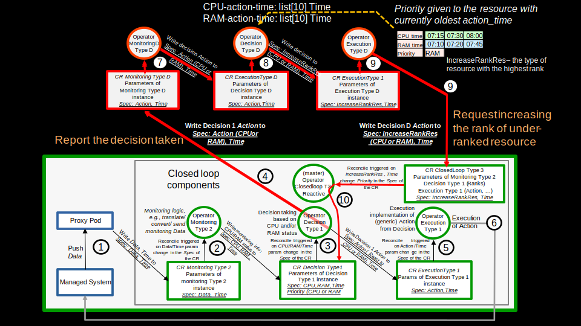</img>

**********************************************************
# CASE A: REACTIVE CLOSED LOOP (isolated loop case)

#### This run illustrates the basic worflow within a loop. In particular, one can observe how particular modules engaged in the loop exchange information by modifying dedicated parts of appropriate custom resource (CR). Each change of the CR invokes respective reconciler that executes appropriate logic of a given function of the loop.
**********************************************************

### STEP 1 ###
The Managed System is modelled by the data-sender being a containerized application that sends a report to the Proxy-Pod. This report contains a triplet describing the usage of resources. As shown in the figure below, the triplet is now equal to {CPU:2 Memory:40 Disk:196}. (Note: running data.go application is described in section (H) of the CONSOLIDATED ACTION SET section above.) The containerized app data.go (models the Managed System) always sends a triplet, but in this demo only the tuple CPU and Mem is used; Disk is ignored as early as in the Proxy-Pod). Physically, this report is sent as a REST message to the Proxy-Pod, and in our case Proxy-Pod has forwarded a tuple {CPU=2 Mem=40} to the Monitoring function. All those operations are covered by **step 1** in the figure.

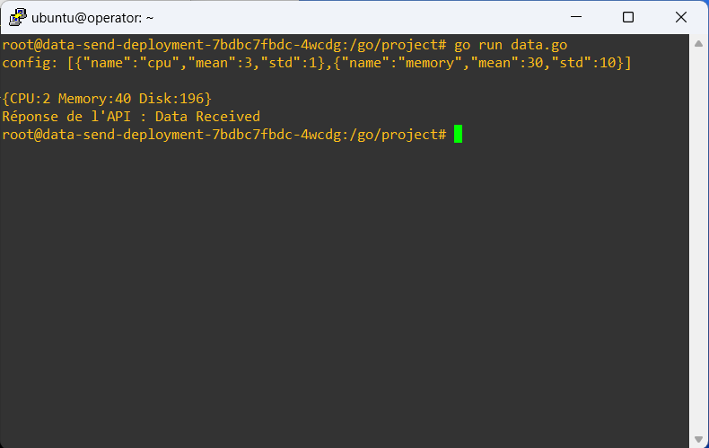</img>

The latter step is confirmed by checking the values (CPU:2, Memory:40) in _Spec.Data_ of Monitoring CR (Custom Resource). This is shown in the screenshot presented below.

Note: to confirm you are verifying the right window check, please the header part of the K9s screenshot in the form _Describe(default/closedloop-v2-monitoring)_. Here, _closedloop_ means you are dealing with the reactive component and _monitoring_ means that the window shows the monitoring CR. Analogously, _closedloopd_ and _monitoringd_ would apply to the case of deliberative loop. Similar rules apply to the remaining functional blocks of both loops.

Additionally, Monitoring operator complements the data tuple with a tag containing the time of receiving the message from the Proxy-Pod. This can be seen in the screenshot as parameter _Spec.Time_ with the value _2023-11-27 11:1:32.386296_ which in subsequent steps will be passed on from operator to operator and recorded in all CRs involved in this instance of the loop. This time tag serves as a unique identifier of message instance so that it is always possible to distinguish between different message instances even if the data carried in those messages (e.g., CPU/Mem/Disk usage) is the same. 

#### STEP 2 ####
Now consider the values received in the context of the monitoring policy applicable in our closed loop. In this case Cpu=2 which is lower than the CPU threshold set to 5 (see _MonitorinData-1-thresholdvalue: 5_ in the figuge below), and Memory=40 is compared to the memory threshold 50 (_MonitorinData-2-thresholdvalue: 50_). In our convention, _MonitorinData-x-thresholkind: inferior_ in the monitoring policy means that if, e.g., _cpu<MonitorinData-1-thresholdvalue_ then the state of CPU is considered to be "Low"; similar interpretation applies to Memory.

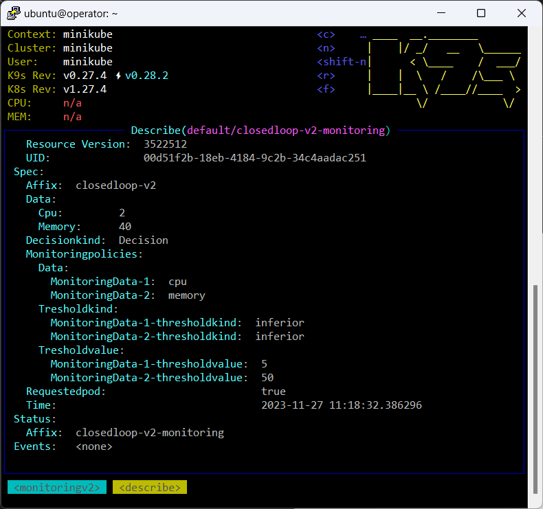</img>

According to the interpretation of the thresholds and the comparison conventions of the monitoring policy described above, obtaining the values of resource usage Cpu=2 and Memory=40 results in sending a notification form the Monitoring to the Decision function indicating "Low cpu, Low memory". This can be confirmed by inspecting the value of the field _Spec.Message_ in the Decision CR - see the figure below.

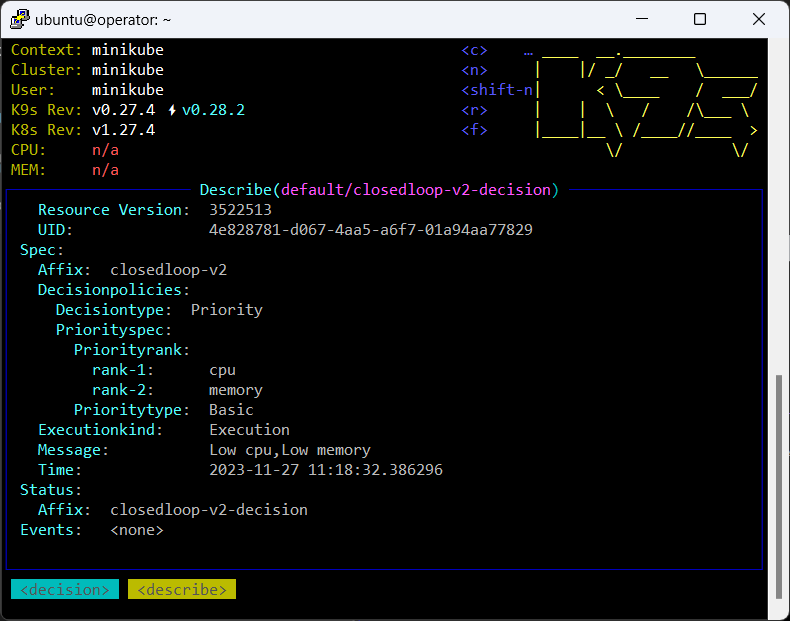</img>

#### STEP 3 ####
The value _PriorityRank.rank-1: cpu_ (flull name _Spec.Decisionpolicies.Priorityspec.Priorityrank.rank-1: cpu_) in Decision CR shown above indicates that Cpu has higher rank than Memory. Therefore, as both resource types have been reported as being in shotage ("Low" state for both of them) and only one can be scaled in a given iteration of the loop, it is CPU that is going to be scaled this time (see our Report for more detailed description of the scaling algorithm). Accordingly, "React to cpu" message is sent to Execution which can be verified by inspecting the value of parameter _Spec.Action_ in the Execution CR - see the figure below.

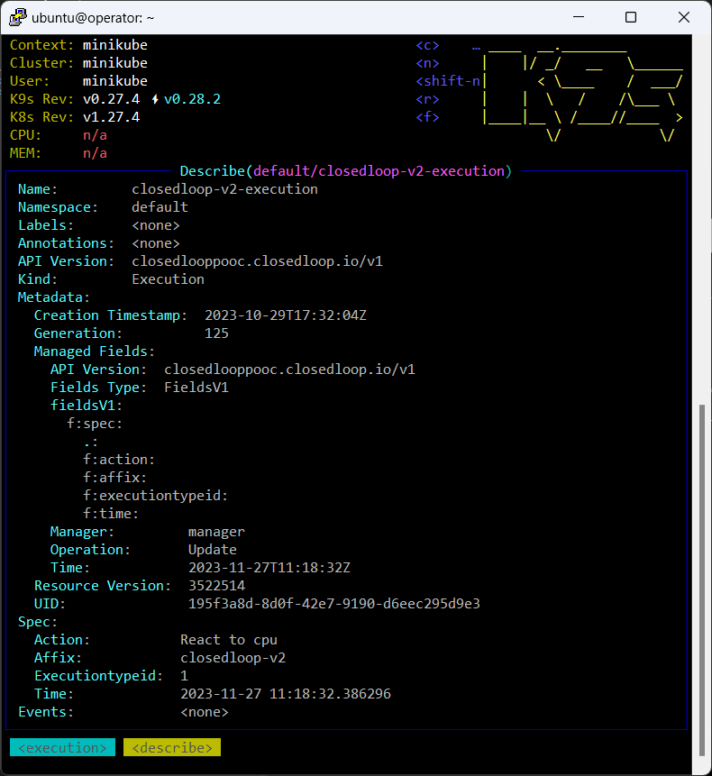</img>

#### STEP 4 ####
Step 4 relates to the deliberative loop component and will be referred to in PART 2 below.

#### STEP 5 and STEP 6 ####
Step 5 and step 6 cover subsequent reaction of Execution to receiving "React to cpu" request from Decision. In the demo, step 5 in Execution does not lead to sending explicit requestr/control message to the Managed System. As we mentioned in the Report, the demo focuses on showing the basic mechanisms feedback operations in the reactive loop have not been implemented (that's also why the data sender application data.go has to be triggered manually to emulate sending consecutive monitoring reports).

**********************************************************

# CASE B: COMBINED REACTIVE & DELIBERATIVE LOOPS (loop interworking)


#### This run illustrates a workflow where the deliberative loop monitors the operation of the reactive loop and in case when the reactive loop does not behave according to the expectation of (policy imposed by) the deliberative component than the deliberative loop changes the priority of resourcers. The overall policy of such prioritization is balancing the number of scaling operations of CPU and memory over long time periods (details of the algorithm are described in the Report). In particular, one can observe how particular modules engaged in the loop exchange information by modifying dedicated parts of appropriate custom resource (CR). The steps of each component (reactive loop, deliberative loop) are interleaved in such an order so that the presentation reflects the real flow of operations in the most natural way.

**********************************************************

***The naming convention - a reminder: The components of the deliberative loop in our example cooperate based on similar principles as in the reactive loop described above. Therefore, the whole structure of the reactive loop is replicated in the deliberative component. In the implementation (code), all components of deliberastive loop are named adding the suffix "\_d" at the end of respective name while in the descriprion below they have the suffix "D" (and in the loop workflow figure from the beginning of this chapter, name format **<component-name> Type D** is used).***

**********************************************************

## Level: Reactive closed loop

In the following figure, we informatively show the master CR of the reactive loop (the CR of operator closedloop). Important in the context of current experiment are fields _Spec.Decisionpolicies.Priorityspec.Priorityrank.rank-1: cpu_ and _Spec.Decisionpolicies.Priorityspec.Priorityrank.rank-2: memory_. They will be subject to changes based on the decision of the deliberative loop. The latter is a new component making the whole setup more "autonomous" (by observing and tunning the operation of the reactive loop). We will observe the changes of those fields in the course of loop operation.

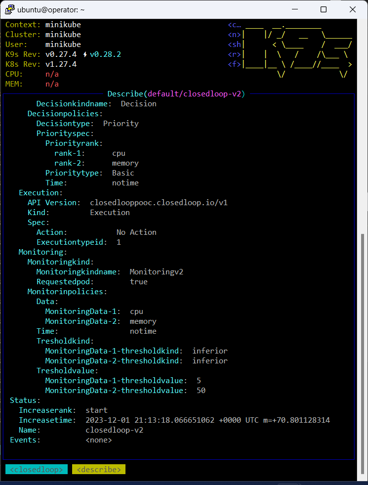</img>

#### STEP 1 ####
Starting the experiment: similarly to the previous case of isolated reactive loop, the tuple CPU:5 Memory:28 is sent to Monitoring. This is shown in the figure below.

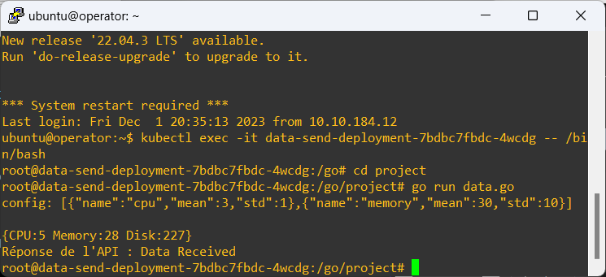</img>

#### STEP 2 ####
Because this time only memory is below respective threshold (memory shortage), the message "Low memory" is sent to Decision, which is confirmed by inspecting the field _Spec.Message_ in the Decision CR whose value is set to "Low memory" - see the figure below (we skipped Monitoring CR to shorten the presentation).

</img>

#### STEP 3 ####
 In reaction to receiving "Low memory", Decision sends "React to memory" notification to Execution (step 3). This can be confirmed by inspecting the valu of parameter _|Spec.ction: React to memory_ in Executiuon CR - see the figure below. Steps 5 and 6 do not propagate subsequent actions as has been described before for the reactive loop component. 
 
 #### STEP 4 ####
 Also, and according to the detailed description of the deliberative loop operation form section 5 of the Report, in parallel to triggering Execution in step 3, the indication of the scaled resource Metric=memory is sent by Decision to MonitoringD that runs in the deliberative loop. This will be shown in the next figure.

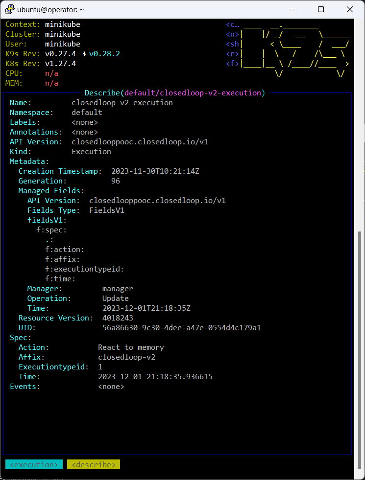</img>

## Level: Deliberative closed loop

#### STEP 7 ####
In the _MonitoringD_ CR (see Fig. 1 below), we can now check the value _Spec.Data.Metric: memory_ - this is what _MonitoringD_ has just received in step 4 from the reactive loop component _Decision_. Also, in the field _Spec.Time_, the value _2023-12-01 21:18:35.936615_ received from the reactive loop has been stored (again, it identifies a message, but also certain "threat" in the loop operation). This value (the tag) will next be sent in step 7 to CR _DecisionD_ (see _Describe(default/closedlopd-v2-decisiond)_ in Fig. 2 below) where this value will be saved in a list _Spec.Data.Memory_ containing the last 10 time epochs when memory was scaled (accordingly, _Spec.Data.Cpu_ applies to CPU scaling time epochs). One can see both lists in the second figure below (in the figure, only one value is stored in both _Spec.Data.Memory_ and _Spec.Data.Cpu_ lists).

Fig. 1. CR _MonitoringD_ - the value of _Spec.Data.Metric: memory_

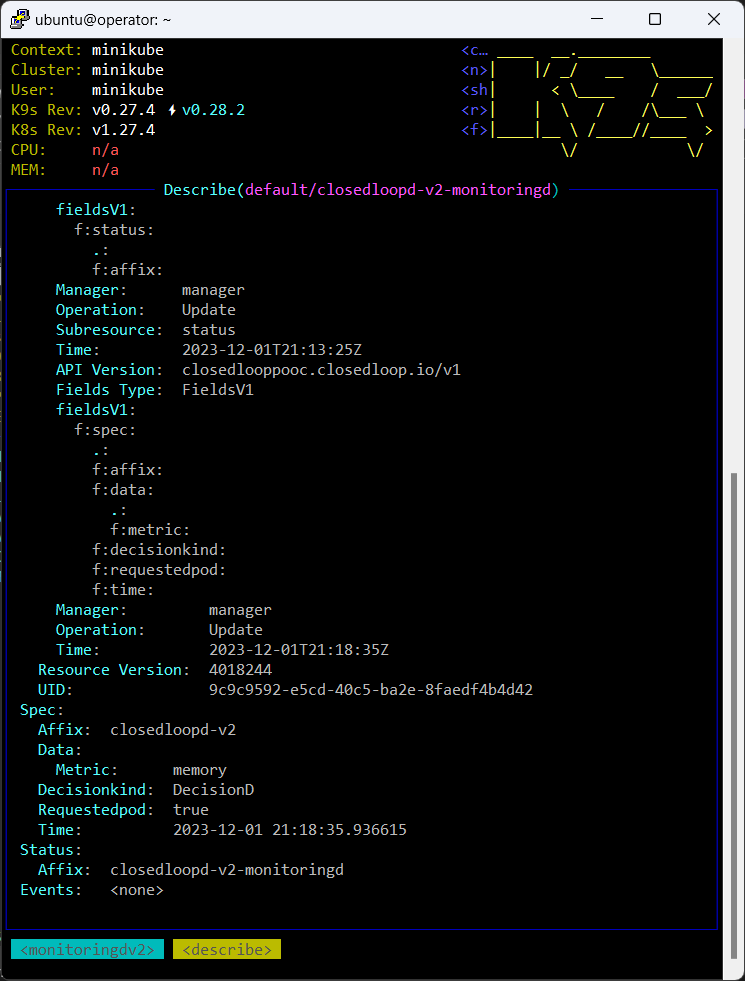</img>

Fig. 2. CR _DecisionD_ - the value of lists _Spec.Data.Memory_ and _Spec.Data.Cpu_ 

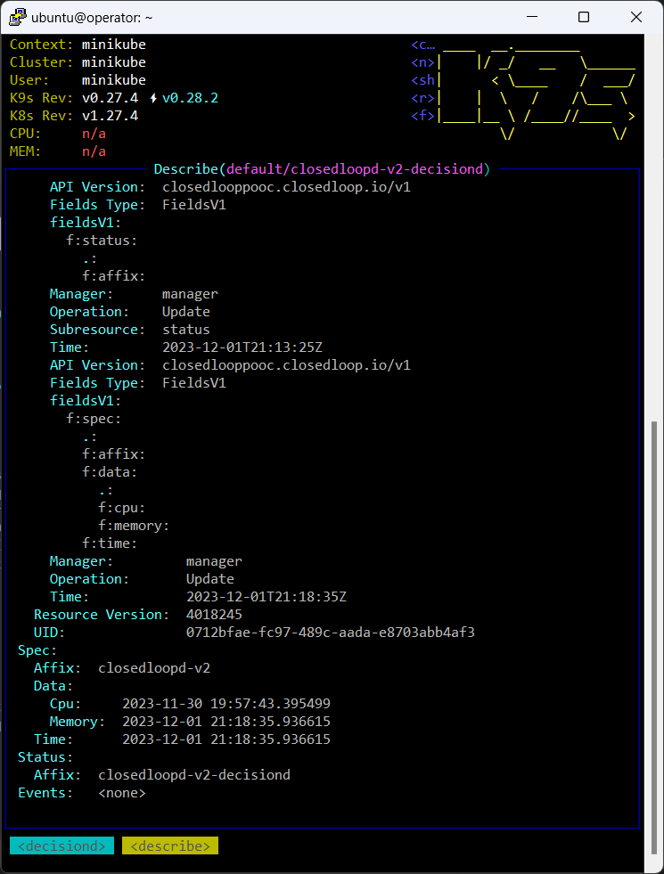</img>

## Level: Reactive closed loop (before modifying Reactive closed loop)

#### Steps 1, 2, 3, 4, 5 ####
In this point, we continue to observe the operation of both loops after having processed several messages by the Managed System (i.g., several runs of data.go application). More specifically, _DecisionD_ has accumulated 9 (nine) elments in the list of CPU scaling time epochs and one element related to Memory. In term of the algorithm implemented in _DecisionD_ this corresponds to a border case when scaling CPU once again will result in adding 10-th element to the CPU list and force changing resource priorities to give higher rank to Memory regardless of which list (resource) currently contains the oldest element overall. The four figures that follow reflect the situation when, respectively, _Cpu=4, Memory=6_ is reported by _ManagedSystem_ (data.go app) - Fig. 1, _Monitoring_ (check the header _Describe(default/closedloop-v2-monitoring)_) registers this tuple in _Spec.Data_ field (check based on _Spec.Monitoringpolicies.Thresholdkind_ / _Thresholdvalue_ that the values mean the lack of both Cpu and Memory) - Fig.2, _Decision_ receives the indication _Low cpu,Low memory_ in _Spec.Message_ field - Fig. 3., and _Execution_ is informed of _React to cpu_ in the field _Spec.Action_ - Fig. 4. These figures correspond to steps 1, 2, 3, and 5 form the loop workflow figure. We also know that as _Decision_ in the reactive component has decided to _React to cpu_, the indication _metric cpu_ is sent from the reactive component to _MonitoringD_ CR in step 4. 

Fig. 1. Step 1 - reporting _Cpu=4, Memory=6_

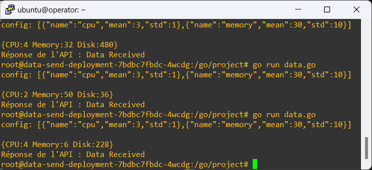</img>

Fig. 2 Step 2 - _Monitoring_ registers the tuple in _Spec.Data_

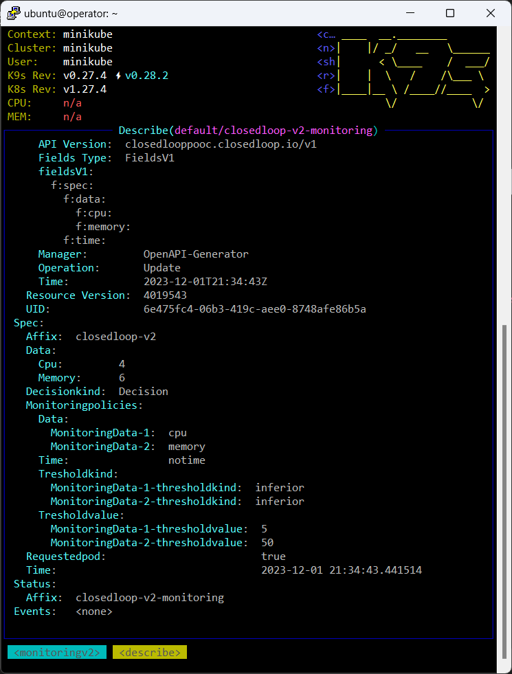</img>

Fig. 3. Step 3 - _Decision_ receives _Low cpu,Low memory_ in _Spec.Message_

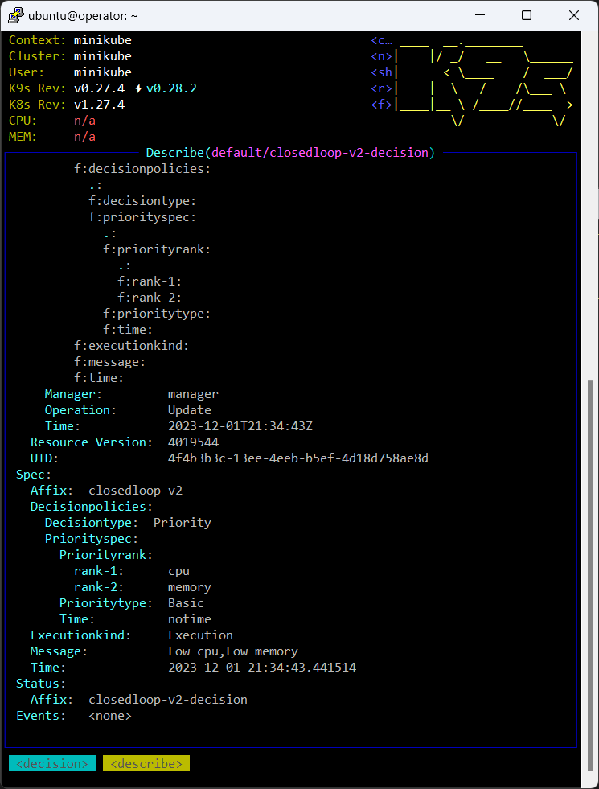</img>

Fig. 4. Step 5 - _Execution_ informed of _React to cpu_ in _Spec.Action_

</img>

## Level: Deliberative closed loop (before modifying Reactive closed loop)

#### STEP 7 ####

In step 4, metric _cpu_ has been written to _MonitoringD_ (see the field _Spec.Data.Metric_ in Fig. 1 below), and togehter with the scaling time (equal to _2013-12-01 21:34:43:441514_) has been reported by _MonitoringD_ to _DecisionD_ and registered by _DecisionD_ in the CR at the end of respective list (Fig. 2, see the list of CPU scaling time epochs in the field _Spec.Data.Cpu_ of custom resource CR _Decisiond_). However, considering that this recent indication from the reactive loop does not change current **oldest** scaling time which remains to be for _cpu_ (compare the heads of lists _Spec.Data.Cpu_ and _Spec.Data.Memory_ in the CR _Decisiond_) _DecisionD_ takes no further action and no indication is sent to _ExecutionD_. Accordingly, nothing is sent to (no modification is executed upon) the master CR of the reactive closed loop. (Note: figures Fig. 3 and Fig. 4 below show that the CRs of _ExecutionD_ and _Closedloop_ remain intact.)

Fig. 1. Step 4 - _cpu_ written to _MonitoringD_

</img>

Fig. 2. Step 7 - _cpu_ written to _DecisionD_ (together with _2013-12-01 21:34:43:441514_ in _Spec.Data.Cpu_ list)

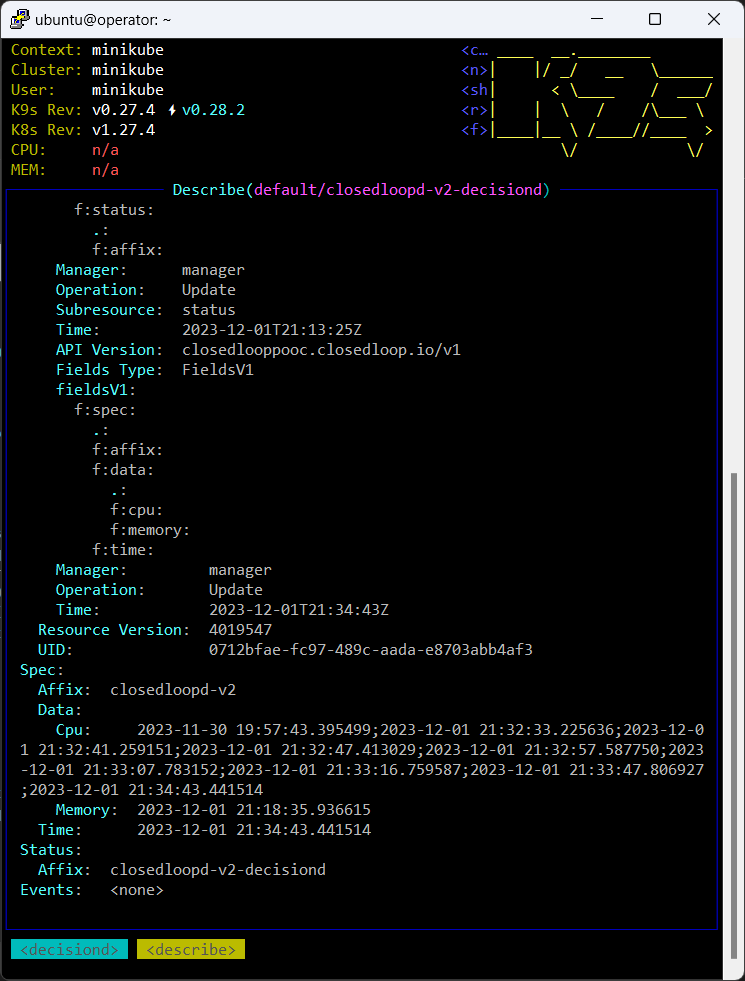</img>

Fig. 3. CR _ExecutionD_ left intact

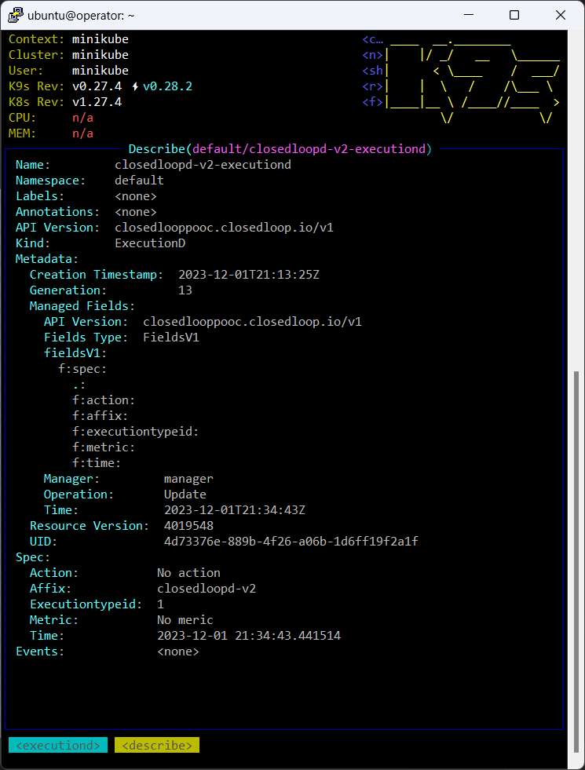</img>

Fig. 4. CR _Closedloop_ left intact

</img>

## Level: Reactive closed loop (after modifying Reactive closed loop)

#### STEPS 1, 2, 3, 5 ####

Now, new data is processed by the reactive closed loop (see the Figures 1-5 below). _React to cpu_ is triggered when _metric cpu_ is sent to the function _MonitoringD_ in the deliberative loop (Figures 1/2/3/4). The last figure, Fig. 5, shows current state of the master CR of the reactive loop (CR _Closedloop_). It can be seen that CPU continues to be the priority resource (the one to be scale if shortage of both resourcers is reported by the Managed System). In the next part of the demo we will see how this changes on the request from the deliberative loop when yet another CPU scaling action takes place.

Fig. 1. Step 1 - Managed System (data.go)

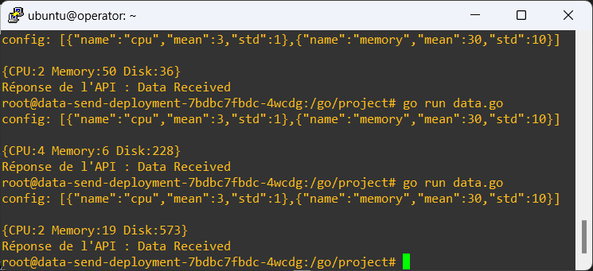</img>

Fig. 2. Step 1/2 - CR _Monitoring_ 

</img>

Fig. 3. Step 2/3 - CR _Decision_

</img>

Fig. 4. Step 5 - CR _Execution_

</img>

Fig. 5. Step 5+ - current state of CR _Closedloop_, the master CR of the reactive closed loop (CR ClosedLoop Type 3 in figure "Operation workflow of the two loops" from the beginning of this presentation)

</img>

## Level: Deliberative closed loop (after modifying Reactive closed loop)

#### STEPS 4, 7, 8

In parallel with step 3 from the last set of figures (in particular, Fig. 3 therein), operator _Decision_ in step 4 sends a notification about its decision to _MonitoringD_ that runs in the deliberative loop (see _Spec.Data.Metric: cpu_ in Fig. 1 below). This notification (_cpu_ in the case considered) is passed on to CR _DecisionD_ in step 7 - see Fig. 2 below. Notice that until now both scaling time epoch lists have not reached their maximum length (equal to 10 elements) so no priority changes have not been generated (the loop started with CPU having the higher rank). But now it is the first time one of the lists (for CPU) reaches the maximum length. According to the algorithm, CPU has to loose its rank in favor of Memory regardless of the fact that still CPU list has the oldest element (compare the lists in Fig. 2). Accordingly, executing step 8 _DecisionD_ changes fields _Spec.Metric=memory_ (with _Spec.Action=Increase rank_) in CR _ExecutionD_ (see Fig. 3 below).

Fig. 1. Step 4 - CR _MonitoringD_ with scaled _Spec.Data.Metric: cpu_

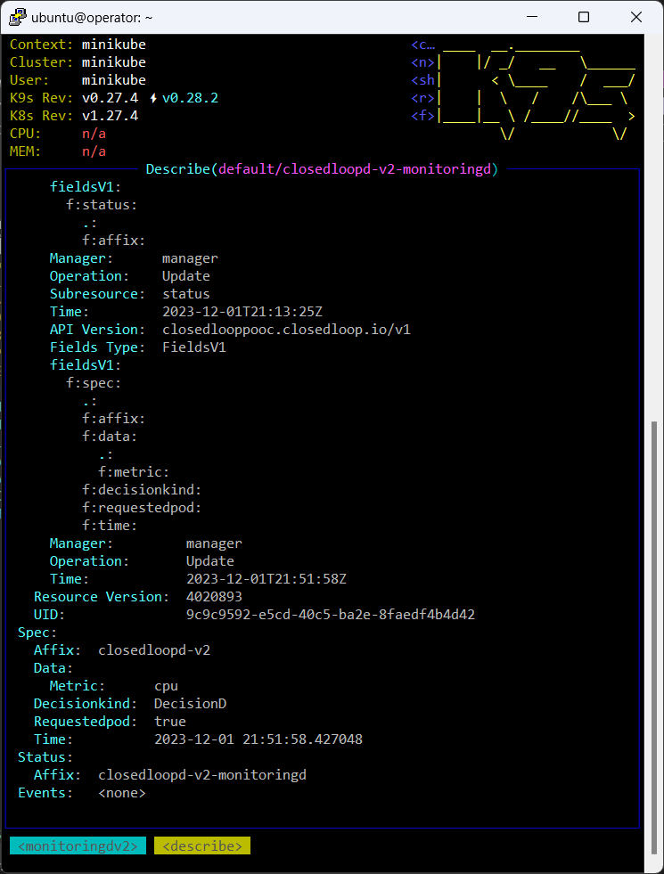</img>

Fig. 2. Step 7 - CR _DecisionD_ with lists _Spec.Data.cpu_ and _Spec.Data.Memory_ (_Spec.Data.cpu_ has just reached the max length 10)

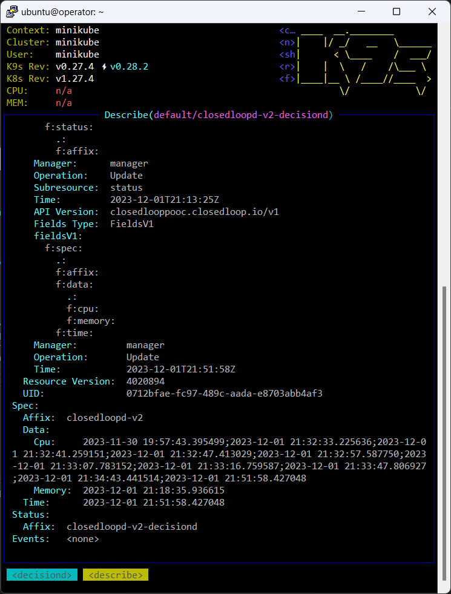</img>

Fig. 3. Step 8 - CR _ExecutionD_ with _Spec.Action: Increase rank_ and _Spec.Metric: memory_
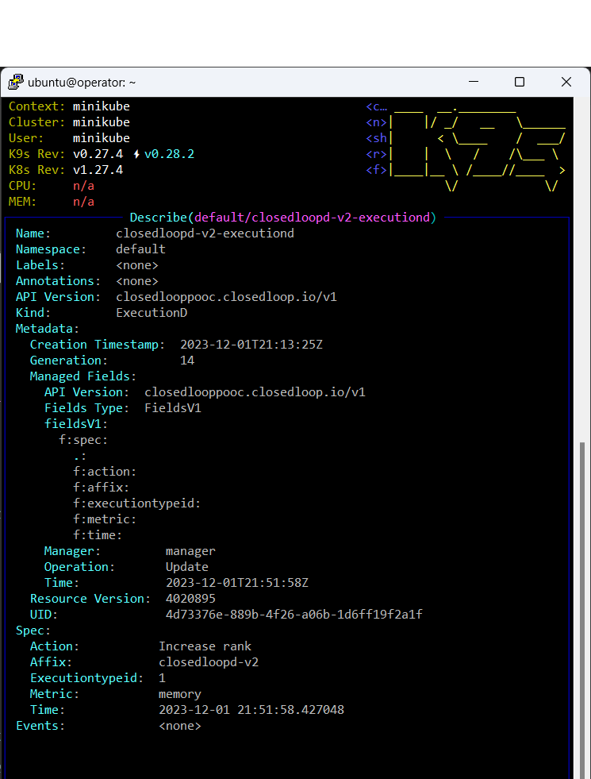</img>

## Level: Reactive closed loop modification on the request from the deliberative loop

#### STEPS 9, 10 ####

In step 9, _ExecutionD_ changes the value of field _Status.Increaserank_ in CR _Closedloop_ to _Status.Increaserank=memory_. This value is then taken by _Closedloop_ operator and propagated to fields _Spec.Monitoring.Monitoringpolicies.Data.MonitoringData-1_ and _Spec.Monitoring.Monitoringpolicies.Data.MonitoringData-2_ (and their derivatives) in CR _Closedloop_, CR _Monitoring_ and CR _Decision_ for changing priority policy (***Note: the index value of in these fields determines the rank/priority of assigned resource, e.g. Spec.Monitoring.Monitoringpolicies.Data.MonitoringData-1: memory sets higher priority to the Memory resource.***)

Fig. 1. Master CR _Closedloop_ - change of _Status.Increaserank_ to _Status.Increaserank=memory_

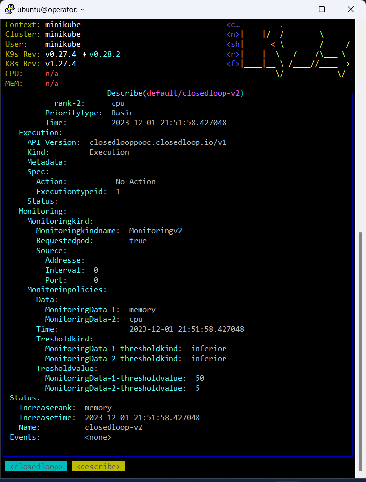</img>

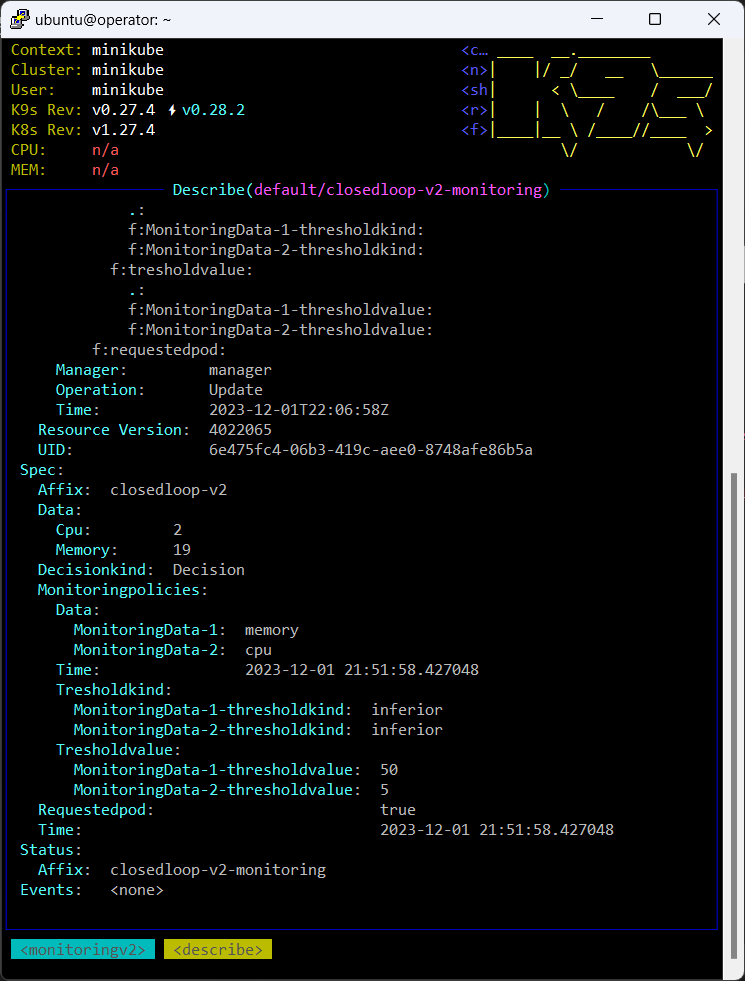</img>

</img>

## Both loops with newly configured Reactive closed loop

In the following, we observe the work of both closed loops after policy change described in the previous point. Observe that now the report states Cpu=3,Memory=36 (Fig. 1) so both resources deserve scaling. However, since memory is prioritized, this time _Decision_ selects Memory to be scaled and informs _Execution_ and _MonitorigD_ accordingly.

## Level: Reactive closed loop

Fig. 1. Step 1 - monitoring report form data.go (Managed System)

</img>

Fig. 2. After step 1 - CR _Monitorig_

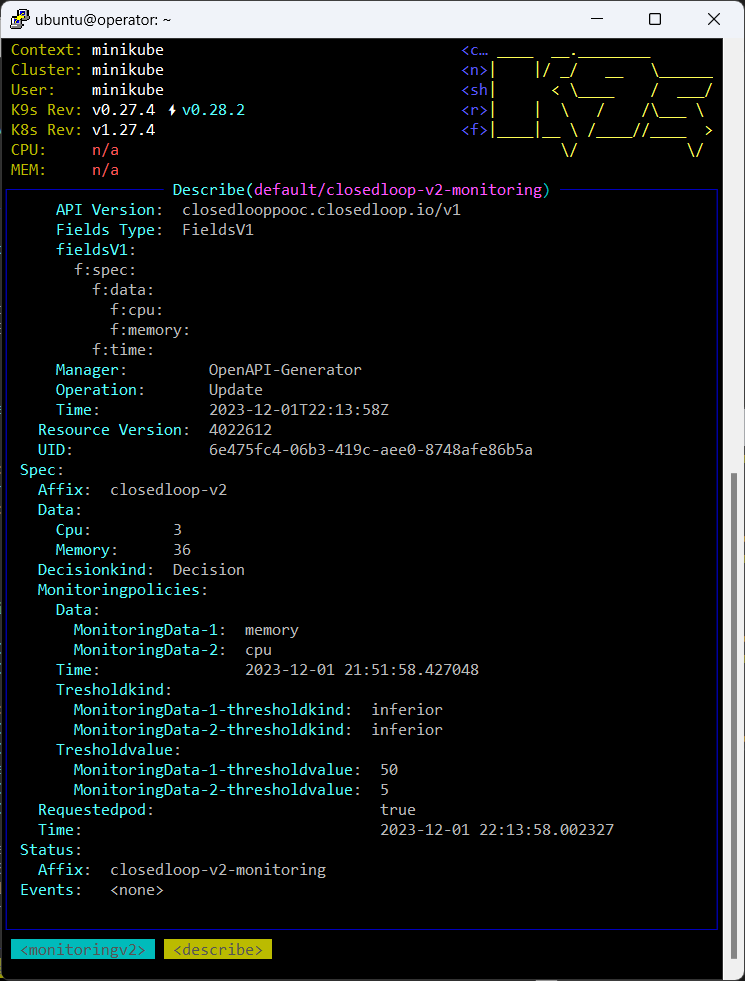</img>

Fig. 3. After step 2 - CR _Decision_

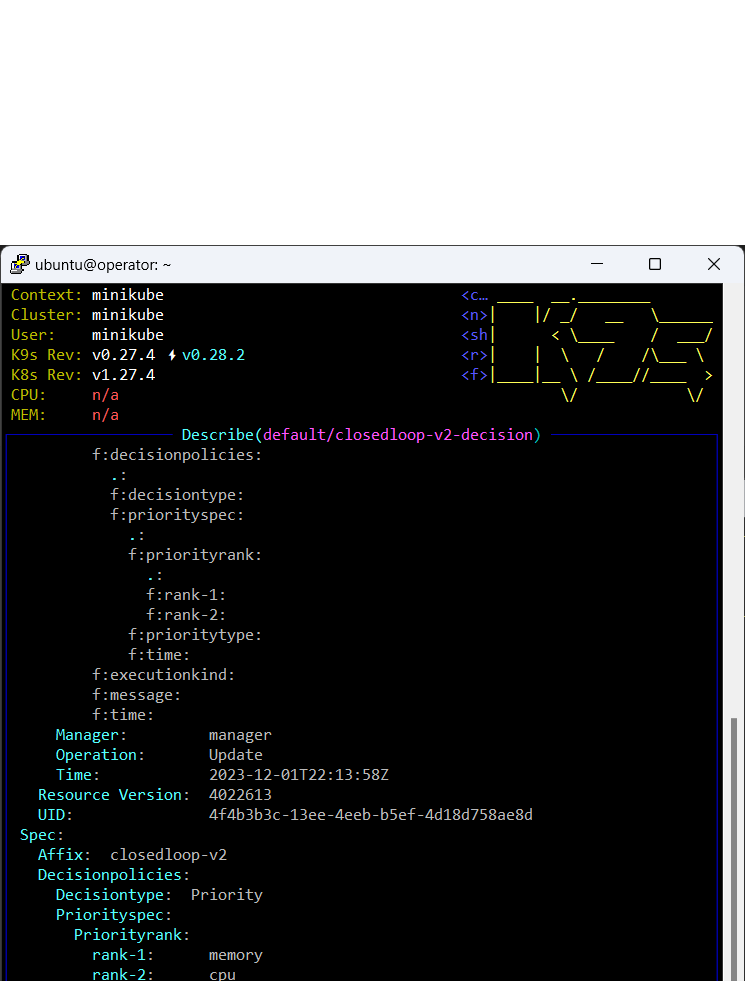</img>

Fig. 4. After step 3 - CR _Execution_

</img>

## Level: Deliberative closed loop

Fig. 5. After step 4 - CR _MonitoringD_

</img>

Fig. 6. After step 7 - CR _DecisionD_ (notice Memory list has been added new element with recent memory caling time epoch)

</img>

Fig. 7. After step 8 - CR _ExecutionD_ - notice _Spec.Action: No action_ set by _DecisionD_

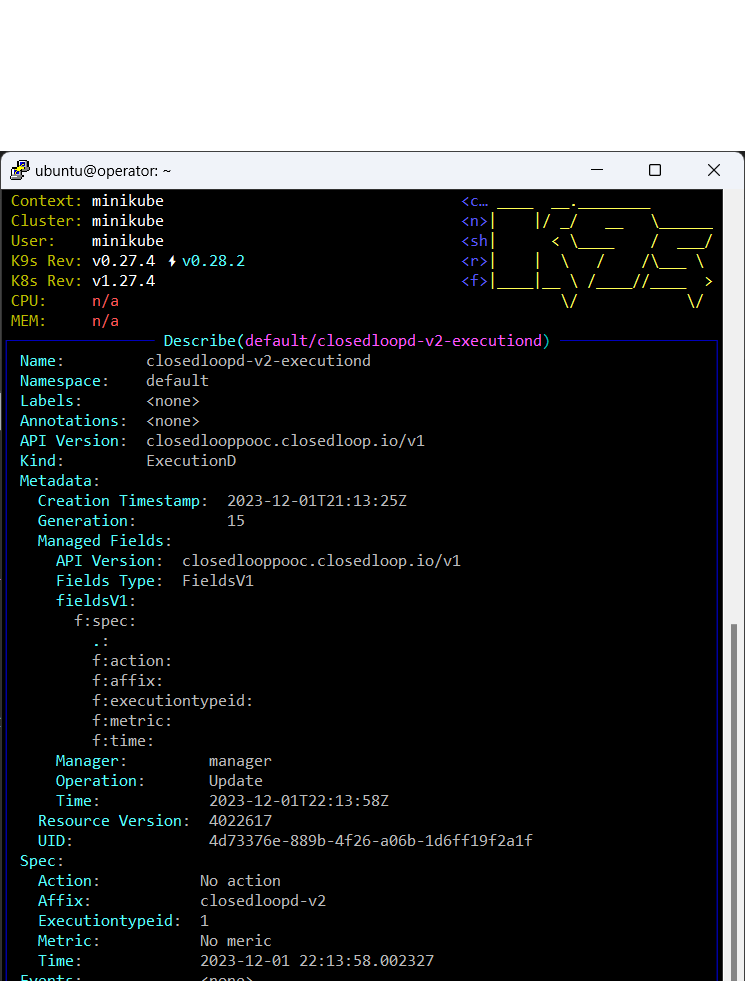</img>


